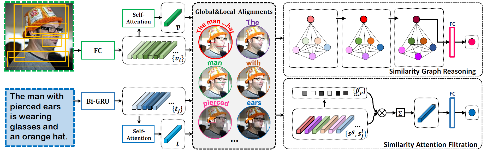

# SGRAF
*PyTorch implementation for AAAI2021 paper of [**“Similarity Reasoning and Filtration for Image-Text Matching”**](https://drive.google.com/file/d/1tAE_qkAxiw1CajjHix9EXoI7xu2t66iQ/view?usp=sharing).* 

*It is built on top of the [SCAN](https://github.com/kuanghuei/SCAN) and [Cross-modal_Retrieval_Tutorial](https://github.com/Paranioar/Cross-modal_Retrieval_Tutorial).* 

*We have released two versions of SGRAF: **Branch `main` for python2.7**; **Branch `python3.6` for python3.6**.* 

*If any problems, please contact me at r1228240468@gmail.com. (r1228240468@mail.dlut.edu.cn is deprecated)*


## Introduction

**The framework of SGRAF:**



## Requirements 
We recommended the following dependencies for ***Branch `python3.6`***.

*  Python 3.6  
*  [PyTorch (>=0.4.1)](http://pytorch.org/)    
*  [NumPy (>=1.12.1)](http://www.numpy.org/)   
*  [TensorBoard](https://github.com/TeamHG-Memex/tensorboard_logger)  
[Note]: The code applies to ***Python3.6 + Pytorch1.7***.

## Acknowledgements
Thanks to the exploration and discussion with [KevinLight831](https://github.com/KevinLight831), we made some adjustments as follows:  
**1. Adjust `evaluation.py`**:  
*for i, (k, v) in enumerate(self.meters.iteritems()):*  
***------>**  ```for i, (k, v) in enumerate(self.meters.items()):```*  
*for k, v in self.meters.iteritems():*   
***------>**  ```for k, v in self.meters.items():```*

**2. Adjust `model.py`**:    
*cap_emb = (cap_emb[:, :, :cap_emb.size(2)/2] + cap_emb[:, :, cap_emb.size(2)/2:])/2*   
***------>**  ```cap_emb = (cap_emb[:, :, :cap_emb.size(2)//2] + cap_emb[:, :, cap_emb.size(2)//2:])/2```*  
   
**3. Adjust `data.py`**:   
*img_id = index/self.im_div*  
***------>**  ```img_id = index//self.im_div```*
   
*for line in open(loc+'%s_caps.txt' % data_split, 'rb'):*    
*tokens = nltk.tokenize.word_tokenize(str(caption).lower().decode('utf-8'))*    

***------>**  ```for line in open(loc+'%s_caps.txt' % data_split, 'rb'):```*  
***------>**  ```tokens = nltk.tokenize.word_tokenize(caption.lower().decode('utf-8'))```*  

or 

***------>**  ```for line in open(loc+'%s_caps.txt' % data_split, 'r', encoding='utf-8'):```*  
***------>**  ```tokens = nltk.tokenize.word_tokenize(str(caption).lower())```*

## Download data and vocab
We follow [SCAN](https://github.com/kuanghuei/SCAN) to obtain image features and vocabularies, which can be downloaded by using:

```bash
wget https://iudata.blob.core.windows.net/scan/data.zip
wget https://iudata.blob.core.windows.net/scan/vocab.zip
```
Another download link is available below：

```bash
https://drive.google.com/drive/u/0/folders/1os1Kr7HeTbh8FajBNegW8rjJf6GIhFqC
```

## Pre-trained models and evaluation
Modify the **model_path**, **data_path**, **vocab_path** in the `evaluation.py` file. Then run `evaluation.py`:

```bash
python evaluation.py
```

Note that `fold5=True` is only for evaluation on mscoco1K (5 folders average) while `fold5=False` for mscoco5K and flickr30K. Pretrained models and Log files can be downloaded from [Flickr30K_SGRAF](https://drive.google.com/file/d/1OBRIn1-Et49TDu8rk0wgP0wKXlYRk4Uj/view?usp=sharing) and [MSCOCO_SGRAF](https://drive.google.com/file/d/1SpuORBkTte_LqOboTgbYRN5zXhn4M7ag/view?usp=sharing).

## Training new models from scratch
Modify the **data_path**, **vocab_path**, **model_name**, **logger_name** in the `opts.py` file. Then run `train.py`:

For MSCOCO:

```bash
(For SGR) python train.py --data_name coco_precomp --num_epochs 20 --lr_update 10 --module_name SGR
(For SAF) python train.py --data_name coco_precomp --num_epochs 20 --lr_update 10 --module_name SAF
```

For Flickr30K:

```bash
(For SGR) python train.py --data_name f30k_precomp --num_epochs 40 --lr_update 30 --module_name SGR
(For SAF) python train.py --data_name f30k_precomp --num_epochs 30 --lr_update 20 --module_name SAF
```

## Reference

If SGRAF is useful for your research, please cite the following paper:

    @inproceedings{Diao2021SGRAF,
      title={Similarity Reasoning and Filtration for Image-Text Matching},
      author={Diao, Haiwen and Zhang, Ying and Ma, Lin and Lu, Huchuan},
      booktitle={AAAI},
      year={2021}
    }

## License

[Apache License 2.0](http://www.apache.org/licenses/LICENSE-2.0).  


